# Mob library

Generated by `art/tools/mobs.mjs` from `art/mobs/mobs.json` -- edit that, then `npm --prefix art run mobs`. 69 mobs; each is an art asset (`art/mobs/*.glb`) and a hostile archetype in `server/data/mobs.json` with the same id, ready to place in a zone (`{"type": "npc", "def": "<id>", "pos": [...], "yaw": 0}`) or use as a bounty archetype.

Clips the client plays: `idle`, `walk`, `sprint`, `die`, `hit` (and `attack`, not yet driven by the server). Missing ones fall back (sprint -> walk -> idle; no `die` -> a procedural fall). Other clips each model ships are kept under snake_case names.

| role | kind | base health | speed | damage | reach |
|---|---|---|---|---|---|
| swarm | melee | 30 @ 1 m | 3.6 | 6 | 1.2 m + radius |
| brute | melee | 110 @ 2.3 m | 3.2 | 18 | 1.6 m + radius |
| flyer | melee | 35 @ 1.4 m | 4.6 | 8 | 1.4 m + radius |
| raider | melee | 60 @ 1.8 m | 4 | 12 | 1.6 m + radius |
| lurker | melee | 70 @ 2 m | 2.2 | 14 | 1.8 m + radius |
| drone | ranged | 30 @ 1 m | 4 | 6 | 22 m (projectile) |
| walker | ranged | 80 @ 1.5 m | 3 | 9 | 26 m (projectile) |

## Packs

| pack | licence | where it came from |
|---|---|---|
| [Ultimate Monsters](https://quaternius.com/packs/ultimatemonsters.html) | CC0 | GitHub mirror mika314/KitchenSink, Assets/Ultimate Monsters/*/glTF (the official Google Drive was over quota) |
| [Ultimate Modular Men (Feb 2022)](https://quaternius.com/packs/ultimatemodularcharacters.html) | CC0 | GitHub mirror osman-1002/3D-3rd-Person-Godot-Game-With-GenAI-Integration, addons/Ultimate Modular Men- Feb 2022 (Individual Characters/glTF; Worker.gltf at the pack root) |
| [Sci-Fi Essentials Kit [Standard]](https://quaternius.com/packs/scifiessentialskit.html) | CC0 | itch.io quaternius/sci-fi-essentials-kit, Standard zip |
| [Modular Sci-Fi MegaKit [Standard]](https://quaternius.com/packs/modularscifimegakit.html) | CC0 | itch.io, Standard zip (Aliens folder; the rest is environment) |
| [Bestiary - Dungeon Monsters Kit [Standard]](https://quaternius.com/packs/bestiarydungeonmonsterskit.html) | Quaternius Asset License v1.0 (not CC0: use in games, no redistribution of the assets themselves) | itch.io, Standard zip (no clips: animated from the Universal Animation Library) |

## Blobs (17)

Ultimate Monsters is authored at toy scale (median 2.6 m); scaled to a ~1 m median.

| | name | id | height | tris | role | health | dmg | clips | notes |
|---|---|---|---|---|---|---|---|---|---|
| 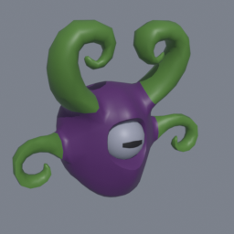 | Alien Blob | `mob.blob.alien` | 1.26 m | 2616 | swarm (melee) | 38 | 8 | attack, dance, die, hit, idle, jump, no, walk, yes |  |
| 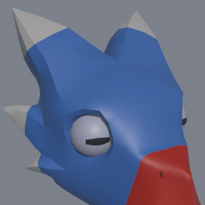 | Birb Blob | `mob.blob.birb` | 1.13 m | 3164 | swarm (melee) | 34 | 7 | attack, dance, die, hit, idle, jump, no, walk, yes |  |
| 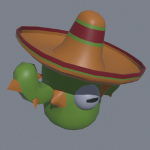 | Cactoro Blob | `mob.blob.cactoro` | 1.4 m | 2388 | swarm (melee) | 42 | 8 | attack, dance, die, hit, idle, jump, no, walk, yes |  |
| 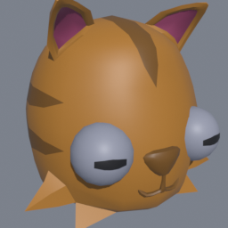 | Cat Blob | `mob.blob.cat` | 0.74 m | 1772 | swarm (melee) | 22 | 4 | attack, dance, die, hit, idle, jump, no, walk, yes |  |
| 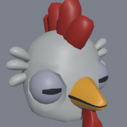 | Chicken Blob | `mob.blob.chicken` | 0.96 m | 2904 | swarm (melee) | 29 | 6 | attack, dance, die, hit, idle, jump, no, walk, yes |  |
| 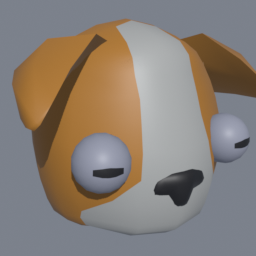 | Dog Blob | `mob.blob.dog` | 0.73 m | 1392 | swarm (melee) | 22 | 4 | attack, dance, die, hit, idle, jump, no, walk, yes |  |
| 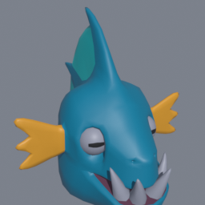 | Fish Blob | `mob.blob.fish` | 1.13 m | 3346 | swarm (melee) | 34 | 7 | attack, dance, die, hit, idle, jump, no, walk, yes |  |
| 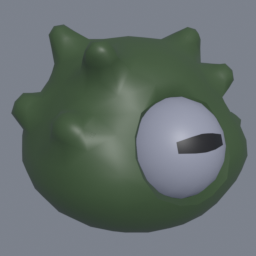 | Green Blob | `mob.blob.green_blob` | 0.75 m | 1520 | swarm (melee) | 23 | 5 | attack, dance, die, hit, idle, jump, no, walk, yes |  |
| 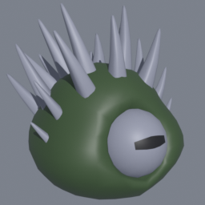 | Green Spiky Blob | `mob.blob.green_spiky_blob` | 1.66 m | 4888 | swarm (melee) | 50 | 10 | attack, dance, die, hit, idle, jump, no, walk, yes |  |
| 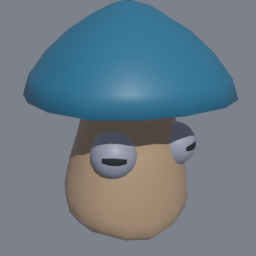 | Mushnub Blob | `mob.blob.mushnub` | 1.3 m | 1248 | swarm (melee) | 39 | 8 | attack, dance, die, hit, idle, jump, no, walk, yes |  |
| 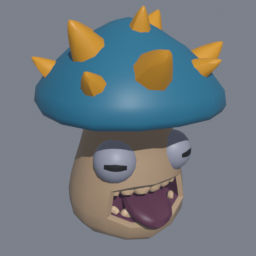 | Mushnub (Evolved) Blob | `mob.blob.mushnub_evolved` | 1.78 m | 3072 | swarm (melee) | 53 | 11 | attack, dance, die, hit, idle, jump, no, walk, yes |  |
| 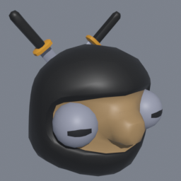 | Ninja Blob | `mob.blob.ninja` | 1.2 m | 2160 | swarm (melee) | 36 | 7 | attack, dance, die, hit, idle, jump, no, walk, yes |  |
| 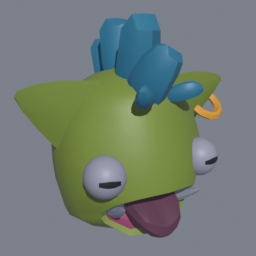 | Orc Blob | `mob.blob.orc` | 0.95 m | 2296 | swarm (melee) | 29 | 6 | attack, dance, die, hit, idle, jump, no, walk, yes |  |
| 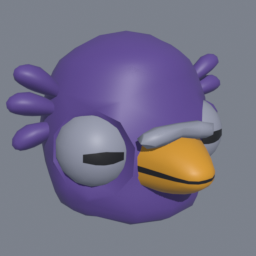 | Pigeon Blob | `mob.blob.pigeon` | 0.72 m | 2184 | swarm (melee) | 22 | 4 | attack, dance, die, hit, idle, jump, no, walk, yes |  |
| 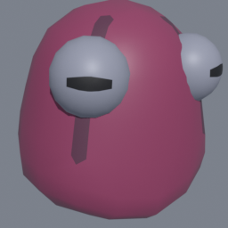 | Pink Blob | `mob.blob.pink_blob` | 0.8 m | 1030 | swarm (melee) | 24 | 5 | attack, dance, die, hit, idle, jump, no, walk, yes |  |
| 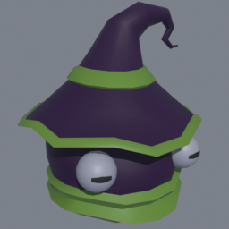 | Wizard Blob | `mob.blob.wizard` | 1.03 m | 1674 | swarm (melee) | 31 | 6 | attack, dance, die, hit, idle, jump, no, walk, yes |  |
| 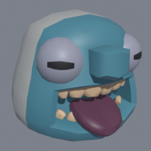 | Yeti Blob | `mob.blob.yeti` | 0.97 m | 2136 | swarm (melee) | 29 | 6 | attack, dance, die, hit, idle, jump, no, walk, yes |  |

## Big monsters (16)

Ultimate Monsters 'Big' (median 3.3 m); scaled to a ~2.35 m median.

| | name | id | height | tris | role | health | dmg | clips | notes |
|---|---|---|---|---|---|---|---|---|---|
| 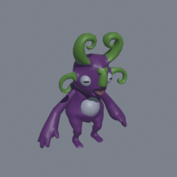 | Alien | `mob.big.alien` | 2.55 m | 7676 | brute (melee) | 122 | 20 | attack, die, duck, hit, idle, jump, jump_idle, jump_land, no, sprint, walk, wave, weapon, yes |  |
| 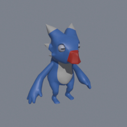 | Birb | `mob.big.birb` | 2.4 m | 5704 | brute (melee) | 115 | 19 | attack, die, duck, hit, idle, jump, jump_idle, jump_land, no, sprint, walk, wave, weapon, yes |  |
| 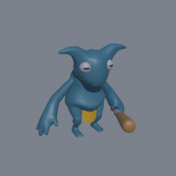 | Blue Demon | `mob.big.blue_demon` | 2.05 m | 5798 | brute (melee) | 98 | 16 | idle | Ships with an idle clip only: slides when it moves, falls over procedurally on death. |
| 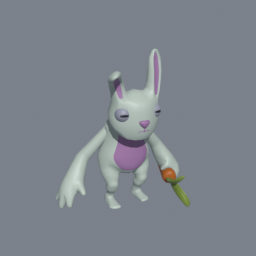 | Bunny | `mob.big.bunny` | 2.48 m | 8282 | brute (melee) | 119 | 19 | attack, die, duck, hit, idle, jump, jump_idle, jump_land, no, sprint, walk, wave, weapon, yes |  |
| 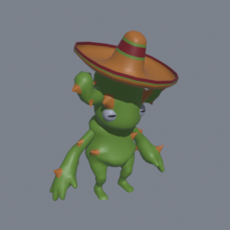 | Cactoro | `mob.big.cactoro` | 2.85 m | 6398 | brute (melee) | 136 | 22 | attack, die, duck, hit, idle, jump, jump_idle, jump_land, no, sprint, walk, wave, weapon, yes |  |
| 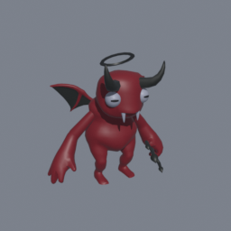 | Demon | `mob.big.demon` | 2.25 m | 6712 | brute (melee) | 108 | 18 | attack, die, duck, hit, idle, jump, jump_idle, jump_land, no, sprint, walk, wave, weapon, yes |  |
| 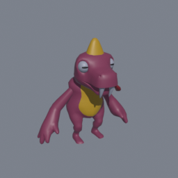 | Dino | `mob.big.dino` | 2.32 m | 5414 | brute (melee) | 111 | 18 | attack, die, duck, hit, idle, jump, jump_idle, jump_land, no, sprint, walk, wave, weapon, yes |  |
| 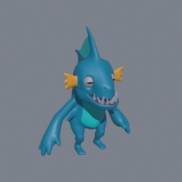 | Fish | `mob.big.fish` | 2.7 m | 6854 | brute (melee) | 129 | 21 | attack, die, duck, hit, idle, jump, jump_idle, jump_land, no, sprint, walk, wave, weapon, yes |  |
| 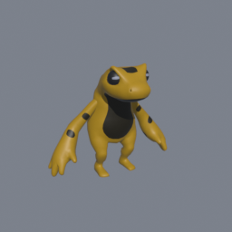 | Frog | `mob.big.frog` | 1.94 m | 5016 | brute (melee) | 93 | 15 | attack, die, duck, hit, idle, jump, jump_idle, jump_land, no, sprint, walk, wave, weapon, yes |  |
| 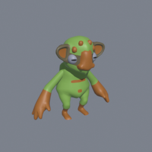 | Monkroose | `mob.big.monkroose` | 2.15 m | 5824 | brute (melee) | 103 | 17 | attack, die, duck, hit, idle, jump, jump_idle, jump_land, no, sprint, walk, wave, weapon, yes |  |
| 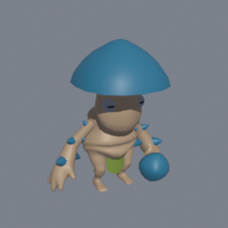 | Mushroom King | `mob.big.mushroom_king` | 2.6 m | 6044 | brute (melee) | 124 | 20 | attack, die, duck, hit, idle, jump, jump_idle, jump_land, no, sprint, walk, wave, weapon, yes |  |
| 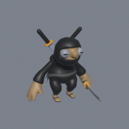 | Ninja | `mob.big.ninja` | 2.17 m | 5964 | brute (melee) | 104 | 17 | attack, die, duck, hit, idle, jump, jump_idle, jump_land, no, sprint, walk, wave, weapon, yes |  |
| 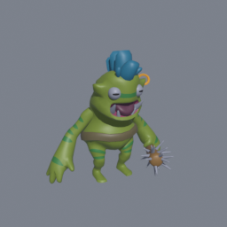 | Orc | `mob.big.orc` | 2.31 m | 7344 | brute (melee) | 110 | 18 | attack, die, duck, hit, idle, jump, jump_idle, jump_land, no, sprint, walk, wave, weapon, yes |  |
| 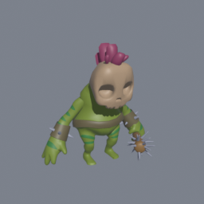 | Orc Skull | `mob.big.orc_skull` | 2.35 m | 7363 | brute (melee) | 112 | 18 | attack, die, duck, hit, idle, jump, jump_idle, jump_land, no, sprint, walk, wave, weapon, yes |  |
| 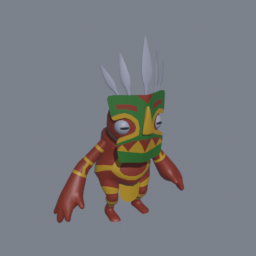 | Tribal | `mob.big.tribal` | 2.83 m | 6620 | brute (melee) | 135 | 22 | attack, die, duck, hit, idle, jump, jump_idle, jump_land, no, sprint, walk, wave, weapon, yes |  |
| 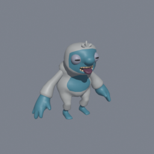 | Yeti | `mob.big.yeti` | 2.04 m | 6094 | brute (melee) | 98 | 16 | attack, die, duck, hit, idle, jump, jump_idle, jump_land, no, sprint, walk, wave, weapon, yes |  |

## Flyers (17)

Ultimate Monsters 'Flying' (median 2.35 m); scaled to a ~1.4 m median.

| | name | id | height | tris | role | health | dmg | clips | notes |
|---|---|---|---|---|---|---|---|---|---|
| 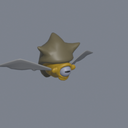 | Alpaking | `mob.flying.alpaking` | 1.28 m | 2508 | flyer (melee) | 32 | 7 | attack, die, hit, idle, no, punch, walk, yes |  |
| 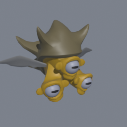 | Alpaking (Evolved) | `mob.flying.alpaking_evolved` | 1.92 m | 4684 | flyer (melee) | 48 | 11 | attack, die, hit, idle, no, punch, walk, yes |  |
| 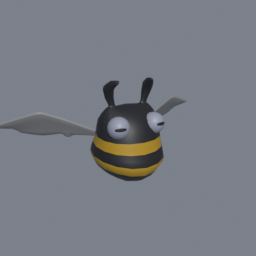 | Armabee | `mob.flying.armabee` | 1.13 m | 2280 | flyer (melee) | 28 | 6 | attack, die, hit, idle, no, punch, walk, yes |  |
| 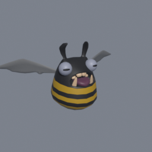 | Armabee (Evolved) | `mob.flying.armabee_evolved` | 1.28 m | 3200 | flyer (melee) | 32 | 7 | attack, die, hit, idle, no, punch, walk, yes |  |
| 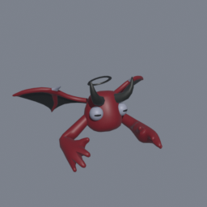 | Flying Demon | `mob.flying.demon` | 1 m | 4784 | flyer (melee) | 25 | 6 | attack, die, hit, idle, no, punch, walk, yes |  |
| 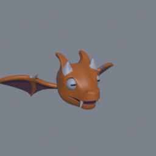 | Dragon | `mob.flying.dragon` | 0.92 m | 4562 | flyer (melee) | 23 | 5 | attack, die, hit, idle, no, punch, walk, yes |  |
| 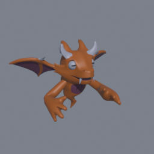 | Dragon (Evolved) | `mob.flying.dragon_evolved` | 1.72 m | 7440 | flyer (melee) | 43 | 10 | attack, die, hit, idle, no, punch, walk, yes |  |
| 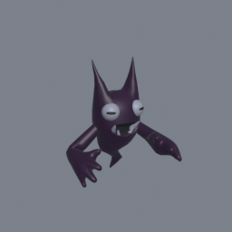 | Ghost | `mob.flying.ghost` | 1.86 m | 3192 | flyer (melee) | 47 | 11 | attack, die, hit, idle, no, punch, walk, yes |  |
| 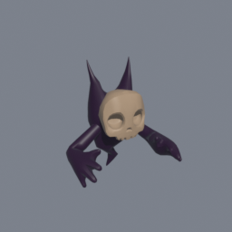 | Ghost Skull | `mob.flying.ghost_skull` | 1.86 m | 3146 | flyer (melee) | 47 | 11 | idle | Ships with an idle clip only: drifts in its idle when it moves, falls over procedurally on death. |
| 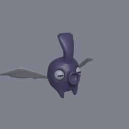 | Glub | `mob.flying.glub` | 1.41 m | 2528 | flyer (melee) | 35 | 8 | attack, die, hit, idle, no, punch, walk, yes |  |
| 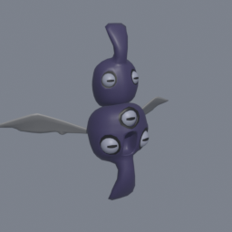 | Glub (Evolved) | `mob.flying.glub_evolved` | 2.22 m | 4452 | flyer (melee) | 56 | 13 | attack, die, hit, idle, no, punch, walk, yes |  |
| 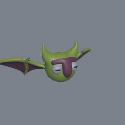 | Goleling | `mob.flying.goleling` | 0.93 m | 3696 | flyer (melee) | 23 | 5 | attack, die, hit, idle, no, punch, walk, yes |  |
| 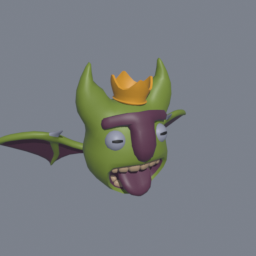 | Goleling (Evolved) | `mob.flying.goleling_evolved` | 1.54 m | 5864 | flyer (melee) | 39 | 9 | attack, die, hit, idle, no, punch, walk, yes |  |
| 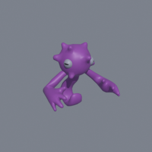 | Hywirl | `mob.flying.hywirl` | 1.65 m | 3296 | flyer (melee) | 41 | 9 | attack, die, hit, idle, no, punch, walk, yes |  |
| 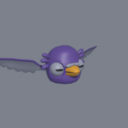 | Flying Pigeon | `mob.flying.pigeon` | 0.82 m | 3512 | flyer (melee) | 21 | 5 | attack, die, hit, idle, no, punch, walk, yes |  |
| 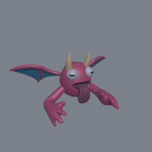 | Squidle | `mob.flying.squidle` | 1.19 m | 4880 | flyer (melee) | 30 | 7 | attack, die, hit, idle, no, punch, walk, yes |  |
| 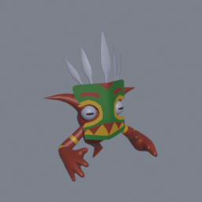 | Flying Tribal | `mob.flying.tribal` | 2.47 m | 5252 | flyer (melee) | 62 | 14 | attack, die, hit, idle, no, punch, walk, yes |  |

## Humans (11)

| | name | id | height | tris | role | health | dmg | clips | notes |
|---|---|---|---|---|---|---|---|---|---|
|  | Adventurer | `mob.human.adventurer` | 1.86 m | 10202 | raider (melee) | 62 | 12 | attack, die, gun_shoot, hit, hit_recieve_2, idle, idle_gun, idle_gun_pointing, idle_gun_shoot, idle_neutral, idle_sword, interact, kick_left, kick_right, punch_left, roll, run_back, run_left, run_right, run_shoot, sprint, sword_slash, walk, wave |  |
|  | Beach | `mob.human.beach` | 1.88 m | 6578 | raider (melee) | 63 | 13 | attack, die, gun_shoot, hit, hit_recieve_2, idle, idle_gun, idle_gun_pointing, idle_gun_shoot, idle_neutral, idle_sword, interact, kick_left, kick_right, punch_left, roll, run_back, run_left, run_right, run_shoot, sprint, sword_slash, walk, wave |  |
|  | Casual | `mob.human.casual_2` | 1.86 m | 5776 | raider (melee) | 62 | 12 | attack, die, gun_shoot, hit, hit_recieve_2, idle, idle_gun, idle_gun_pointing, idle_gun_shoot, idle_neutral, idle_sword, interact, kick_left, kick_right, punch_left, roll, run_back, run_left, run_right, run_shoot, sprint, sword_slash, walk, wave |  |
|  | Hoodie | `mob.human.casual_hoodie` | 1.87 m | 6206 | raider (melee) | 62 | 12 | attack, die, gun_shoot, hit, hit_recieve_2, idle, idle_gun, idle_gun_pointing, idle_gun_shoot, idle_neutral, idle_sword, interact, kick_left, kick_right, punch_left, roll, run_back, run_left, run_right, run_shoot, sprint, sword_slash, walk, wave |  |
|  | Farmer | `mob.human.farmer` | 1.86 m | 5476 | raider (melee) | 62 | 12 | attack, die, gun_shoot, hit, hit_recieve_2, idle, idle_gun, idle_gun_pointing, idle_gun_shoot, idle_neutral, idle_sword, interact, kick_left, kick_right, punch_left, roll, run_back, run_left, run_right, run_shoot, sprint, sword_slash, walk, wave |  |
|  | King | `mob.human.king` | 1.9 m | 11110 | raider (melee) | 63 | 13 | attack, die, gun_shoot, hit, hit_recieve_2, idle, idle_gun, idle_gun_pointing, idle_gun_shoot, idle_neutral, idle_sword, interact, kick_left, kick_right, punch_left, roll, run_back, run_left, run_right, run_shoot, sprint, sword_slash, walk, wave |  |
|  | Punk | `mob.human.punk` | 1.97 m | 5500 | raider (melee) | 66 | 13 | attack, die, gun_shoot, hit, hit_recieve_2, idle, idle_gun, idle_gun_pointing, idle_gun_shoot, idle_neutral, idle_sword, interact, kick_left, kick_right, punch_left, roll, run_back, run_left, run_right, run_shoot, sprint, sword_slash, walk, wave |  |
|  | Spacesuit | `mob.human.spacesuit` | 1.89 m | 10558 | raider (melee) | 63 | 13 | attack, die, gun_shoot, hit, hit_recieve_2, idle, idle_gun, idle_gun_pointing, idle_gun_shoot, idle_neutral, idle_sword, interact, kick_left, kick_right, punch_left, roll, run_back, run_left, run_right, run_shoot, sprint, sword_slash, walk, wave |  |
|  | Suit | `mob.human.suit` | 1.86 m | 7674 | raider (melee) | 62 | 12 | attack, die, gun_shoot, hit, hit_recieve_2, idle, idle_gun, idle_gun_pointing, idle_gun_shoot, idle_neutral, idle_sword, interact, kick_left, kick_right, punch_left, roll, run_back, run_left, run_right, run_shoot, sprint, sword_slash, walk, wave |  |
|  | Swat | `mob.human.swat` | 1.85 m | 8794 | raider (melee) | 62 | 12 | attack, die, gun_shoot, hit, hit_recieve_2, idle, idle_gun, idle_gun_pointing, idle_gun_shoot, idle_neutral, idle_sword, interact, kick_left, kick_right, punch_left, roll, run_back, run_left, run_right, run_shoot, sprint, sword_slash, walk, wave |  |
|  | Worker | `mob.human.worker` | 1.87 m | 5240 | raider (melee) | 62 | 12 | attack, die, gun_shoot, hit, hit_recieve_2, idle, idle_gun, idle_gun_pointing, idle_gun_shoot, idle_neutral, idle_sword, interact, kick_left, kick_right, punch_left, roll, run_back, run_left, run_right, run_shoot, sprint, sword_slash, walk, wave |  |

## Mechs (3)

| | name | id | height | tris | role | health | dmg | clips | notes |
|---|---|---|---|---|---|---|---|---|---|
|  | Eye Drone | `mob.mech.eye_drone` | 1 m | 3530 | drone (ranged) | 30 | 6 | attack, back_flip, charging, hit, idle, walk | Floats; no walk or death clip (Look plays while it moves, procedural fall on death). |
|  | Quad Shell | `mob.mech.quad_shell` | 1.49 m | 7494 | walker (ranged) | 79 | 9 | attack, charge, die, hit, idle, look, sprint, walk |  |
|  | Trilobite | `mob.mech.trilobite` | 2.49 m | 8338 | walker (ranged) | 133 | 15 | attack, attack_auto, die, hanging, hit, idle, look, sprint, walk |  |

## Aliens (3)

| | name | id | height | tris | role | health | dmg | clips | notes |
|---|---|---|---|---|---|---|---|---|---|
|  | Cyclops | `mob.alien.cyclop` | 2.01 m | 2084 | lurker (melee) | 70 | 14 | idle | Ships with an idle clip only (Alien_Idle). |
|  | Oculichrysalis | `mob.alien.oculichrysalis` | 1.53 m | 6440 | lurker (melee) | 54 | 11 | idle | Ships with an idle clip only (Alien_Idle). |
|  | Scolitex | `mob.alien.scolitex` | 3.36 m | 11036 | lurker (melee) | 118 | 24 | idle | Ships with an idle clip only (Alien_Idle). |

## Dungeon monsters (2)

| | name | id | height | tris | role | health | dmg | clips | notes |
|---|---|---|---|---|---|---|---|---|---|
|  | Imp | `mob.dungeon.imp` | 1.68 m | 15232 | brute (melee) | 80 | 13 | attack, die, hit, idle, sprint, walk |  |
|  | Puglin | `mob.dungeon.puglin` | 0.93 m | 7528 | swarm (melee) | 28 | 6 | attack, die, hit, idle, sprint, walk |  |
