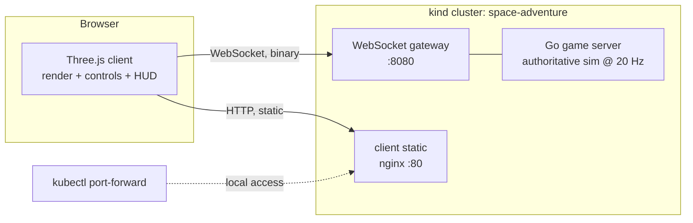

# Architecture

Status: v0 (scaffold) — updated as M1 lands.

## System overview

- One authoritative Go server process per world instance (M1: single
  instance).
- Browser clients connect over WebSocket; all world state is
  server-authoritative.
- Everything runs in a local kind cluster, namespace `space-adventure`.

## Client (`client/`) — Three.js + TypeScript

- Vite dev server; production: static bundle served by nginx (`deploy/`).
- Scene: low-poly space (starfield, asteroid props); ships loaded from `art/`
  via `art/manifest.json` by asset id.
- Net client: WebSocket, binary frames per `docs/PROTOCOL.md`.
- Local player: client-side prediction, reconciled against snapshots.
- Remote players: ~100 ms interpolation buffer + short extrapolation.
- HUD: DOM overlay (M1) — speed, distance to nearest player, connection state.

## Server (`server/`) — Go

- Module `space-adventure/server`; stdlib-first; gorilla/websocket.
- Fixed-tick authoritative simulation: **20 Hz (50 ms)**. Deterministic given
  (world seed, input stream).
- Components: connection manager, entity/component store, tick loop, snapshot
  encoder, gameplay rules (from `docs/GDD.md`, owned by `game`).
- Full snapshot every tick in M1; delta compression is a post-M1 optimization.
- No persistence in M1: in-memory world, seed-based.

## Network model

- Wire contract: `docs/PROTOCOL.md` (little-endian binary, length-prefixed).
- Server sends a snapshot (all entities: id, pos, quat, vel + tick) every tick.
- Client sends `input` as **current command state** (latest wins, idempotent) —
  no input sequencing needed for M1.
- Prediction: the local player integrates inputs locally at 60 Hz for
  responsiveness; on each snapshot the client blends toward server state
  (≈1 tick lerp) — since inputs converge, correction is small.
- Reconnect: M1 = drop and rejoin (new entity id); session resumption later.
- Heartbeat: ping/pong frames; server drops connections silent for 10 s.

## Deployment (`deploy/`) — kind

- kind cluster (Docker on WSL2); namespace `space-adventure`.
- Workloads: `server` (Deployment + Service, :8080), `client` (nginx static,
  :80). Same-origin client→server to avoid CORS.
- Local access via `kubectl port-forward`; `make up` / `make down` wrap the
  whole lifecycle.
- Scaling path (post-M1): one server per system/sector shard, stateless
  connections behind a gateway. Not M1.

## Key decisions

| Decision | Choice | Why |
|---|---|---|
| 3D engine | Three.js + TypeScript | deepest ecosystem, browser-native, full control |
| Server language | Go | one static binary; goroutines fit tick + IO |
| Transport | WebSocket (binary) | simple, works everywhere; revisit UDP if M1 feels limited |
| Authority | server-authoritative | MMO correctness, cheat resistance |
| Local K8s | kind | closest to real K8s, fast, scriptable on WSL2 |
| Assets | glTF 2.0 binary, low-poly | one universal format, reproducible generation |

## Risks / watch items

- Port-forwarded WebSocket adds local latency; M1 targets are set modestly
  (ROADMAP criteria) and `qa` measures them.
- Snapshot bandwidth grows linearly with entity count; delta snapshots come
  after M1.
- 6-DOF flight feel over a 100 ms interpolation buffer is the main UX risk of
  M1 — the flight model (GDD) is tuned to survive it.
