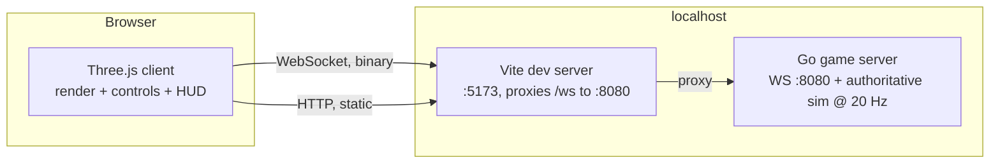

# Architecture

Status: v0 (scaffold) — updated as M1 lands.

## System overview

- One authoritative Go server process per world instance (M1: single
  instance).
- Browser clients connect over WebSocket; all world state is
  server-authoritative.
- M1 runs as **two local processes** (`go run` + `vite`), started by `make up`.
  Vite proxies `/ws` to the server so client and server are same-origin.
- Containers and Kubernetes arrive at the scale-out milestone, not before — see
  "Deployment".

## Client (`client/`) — Three.js + TypeScript

- Vite dev server in M1 (also the `/ws` proxy); a static production bundle
  behind a real web server is a concern for the scale-out milestone.
- Scene: a small low-poly round world — terrain mesh built from the server's
  six-face cube-sphere radius field, sky, scattered props; characters loaded
  from `art/` via `art/manifest.json` by asset id.
- **The camera's up vector is the local radial direction**, not `+Y`. It
  changes continuously as the player walks, and getting it wrong shows up as
  the world slowly rolling. Same for character orientation: remote players
  stand on their own patch of ground, not on yours.
- Net client: WebSocket, binary frames per `docs/PROTOCOL.md`.
- **Camera: one first-person rig, always.** The game is first person on foot
  and in the pilot seat alike (GDD pillar 2), so the client has exactly one
  camera whose *mount point* changes — the body's eye height in M1, a `seat.*`
  node in a vehicle from M2. Build the mount as an indirection from the start;
  do not build a chase cam "for debugging" and let it become load-bearing.
- Look is applied to the camera immediately on input and sent to the server as
  `look_dir`, an absolute world-space unit vector. It is never predicted or
  reconciled — a corrected view is motion sickness. Only position/velocity go
  through prediction and replay.
- Rock props are scattered client-side from `world_seed` onto the sampled
  surface. Every client runs the same TypeScript, so every client scatters them
  identically; the server neither knows nor cares, because M1 props have no
  collision. The moment props become collidable, placement has to move
  server-side.
- **Movement and terrain sampling live in a pure module** — no DOM, no Three.js,
  no browser globals — that the render loop calls into. This is not style: the
  conformance test (ROADMAP criterion 5) runs the TypeScript sim headless
  under Node and diffs it against the Go sim, which is impossible if movement
  is entangled with the renderer. Same reason the module takes `dt` and input
  as arguments rather than reading a clock.

  Four things keep this honest, in order of how much work they save:

  1. **The compiler enforces it.** `client/src/sim/` compiles under its own
     `tsconfig.sim.json` with `"lib": ["ES2022"]` and **no `"DOM"`**. Touching
     `window`, `document`, `performance` or `requestAnimationFrame` in that
     folder is then a build error, not a code-review note — and `make build`
     already runs it. No lint rules, no custom tooling, no discipline required.
  2. **A signature, fixed now**, so the Go and TypeScript sims mirror each
     other and criterion 5 has something to diff:
     `step(state, input, terrain, dt) -> state` and
     `sampleRadius(terrain, dir) -> number`, both pure, both total.
  3. **Build the sim module before the renderer.** Extracting a sim out of a
     finished render loop is where this normally goes wrong; starting with a
     headless module that a renderer later calls costs nothing.
  4. **A ten-line headless smoke test in wave 2**, not wave 3 — `frontend`
     imports the sim under Node and steps it once. It fails the moment someone
     reaches for Three inside `sim/`, which is months before `qa` would have
     found it at the gate.
- **Trajectory dump format** (shared by both sims, so criterion 5 is a file
  diff rather than bespoke harness code): given a JSONL input script — one
  `input` per line plus a starting state — each sim emits JSONL of
  `{tick, pos:[x,y,z], vel:[x,y,z], grounded}` per step. The Go server exposes
  it as a subcommand, the client sim as a Node entry point.
- Local player: client-side prediction, reconciled against snapshots.
- A dev override (query param or console hook) can force the local player's
  position/velocity to a bad value, so authority correction is observable —
  ROADMAP criterion 3 depends on it existing.
- Remote players: ~100 ms interpolation buffer + short extrapolation.
- HUD: DOM overlay (M1) — speed, distance to nearest player, connection state.
  A cockpit-mounted diegetic HUD is a later option, not an M1 obligation.

## Server (`server/`) — Go

- Module `space-adventure/server`; stdlib-first; gorilla/websocket.
- Fixed-tick authoritative simulation: **20 Hz (50 ms)**. Deterministic given
  (world seed, input stream).
- Components: connection manager, entity/component store, tick loop, snapshot
  encoder, gameplay rules (from `docs/GDD.md`, owned by `game`).
- Full snapshot every tick in M1; delta compression is a post-M1 optimization.
- No persistence in M1: in-memory world, seed-based.
- Terrain: generated procedurally once at startup from the world seed as a
  cube-sphere — six `face_grid × face_grid` grids of surface radii, layering
  base relief, masked mountain ridges, detail noise and subtractive craters
  (GDD "M1 terrain generation") — sent to each client on join (PROTOCOL
  `terrain`), and used server-side for on-foot collision by bilinear sample.
  No collision library, no mesh physics — the ground is six arrays and a
  face-selection rule.
- `world_seed` comes from a `--seed` flag with a **fixed default**, not from
  the clock. A seed that changes every boot gives you a different asteroid on
  every restart, which makes iterating on movement against a known landmark
  impossible and makes a bug report unreproducible. Random worlds are one flag
  away when they are wanted.
- Because the field ships over the wire, **the generator is not a contract**:
  no client re-derives it, so the noise functions can be swapped or retuned
  without touching the protocol or the client. Only the shape constraints
  (walkable fraction, flat spawn, radius bounds) are binding, and they are
  checked against the generated field rather than the code.
- **A connection drives an entity; it does not equal one.** In M1 the entity a
  connection drives is its body, which stays true forever. From M2 a player may
  drive a vehicle instead while their body rides in a seat, so keep "the entity
  this input moves" as a lookup rather than a fixed field on the connection —
  that lookup is exactly what taking a pilot seat repoints (GDD "Vehicles and
  crew").

## Network model

- Wire contract: `docs/PROTOCOL.md` (little-endian binary, one message per
  WebSocket message).
- Server sends a snapshot (all entities: id, pos, quat, vel + tick + `ack_seq`)
  every tick.
- Client sends `input` as **current command state** (latest wins, idempotent),
  tagged with a `seq` counter. The server echoes the `seq` it last applied as
  `ack_seq`.
- Prediction: the local player is simulated client-side in **fixed 50 ms steps
  — the same tick rate as the server**, with the render loop interpolating
  between the last two predicted states for 60 fps smoothness. Sampling input
  at 60 Hz but stepping the sim at 60 Hz too would drift from the server by
  construction (different `dt` through the clamps and the acceleration term),
  and replay would then correct a divergence the client created itself.
- Reconciliation (**replay, not blend**): the client keeps a ring buffer of the
  inputs it has sent. On each snapshot it snaps the local player to the server
  state, discards buffered inputs up to `ack_seq`, and re-integrates the
  remaining ones with the GDD rule table to get back to present time. Remote
  players are interpolated, never replayed.
  - Blending toward server state instead would rubber-band: a snapshot reflects
    input from ~RTT/2 ago, so steady-state error is `velocity × latency` —
    at `sprint_speed` 7.5 m/s and 100 ms that is ~0.75 m of constant lag on
    foot, and roughly 4 m once ships fly at `vmax` 40 u/s. Replay makes the
    error zero when client and server agree.
  - Prediction and server must run the identical rule table and the identical
    integrator (semi-implicit Euler, per-tick `dt`), or replay reintroduces the
    drift it exists to remove. The movement conformance test
    (ROADMAP criterion 5) runs against both.
- Reconnect: M1 = drop and rejoin (new entity id); session resumption later.
- Heartbeat: ping/pong frames; server drops connections silent for 10 s.

## Deployment (`deploy/`) — local processes in M1

M1 is two processes on one dev machine, so that is all the deployment it gets:

- `make up` — starts the Go server (`go run ./cmd/server`, WS on :8080) and the
  Vite dev server (:5173, `/ws` proxied to :8080, so same-origin, no CORS).
- `make down` — stops both. `make build` — `go build` + `npm run build`,
  the CI-shaped check.
- No containers, no cluster, no port-forward in M1.

**Why not kind yet.** Kubernetes solves scheduling more than one thing onto
more than one machine; M1 has two processes on one laptop. Paying for it early
costs Dockerfiles, an image-load step, manifests, probes and port-forwards
before a single ship moves — and `kubectl port-forward` is a userspace TCP
proxy whose jitter would land directly on the M1 latency target, so a failed
measurement would tell us nothing about the game.

Scaling path (the scale-out milestone, when it earns its keep): containerize both, kind cluster in
namespace `space-adventure`, one server per system/sector shard, stateless
connections behind a gateway. The client already talks to a URL, so this is an
additive change, not a rewrite.

## Key decisions

| Decision | Choice | Why |
|---|---|---|
| 3D engine | Three.js + TypeScript | deepest ecosystem, browser-native, full control |
| Server language | Go | one static binary; goroutines fit tick + IO |
| Transport | WebSocket (binary) | simple, works everywhere; revisit UDP if M1 feels limited |
| Authority | server-authoritative | MMO correctness, cheat resistance |
| Local run (M1) | two processes + Makefile | two processes on one box need no orchestrator; keeps the latency target measurable |
| Local K8s | kind, deferred to scale-out | closest to real K8s when sharding actually needs it |
| Prediction | replay from `ack_seq` | blending rubber-bands by `velocity × latency`; replay is exact when the rule tables match |
| Assets | glTF 2.0 binary, low-poly | one universal format, reproducible generation |

## Risks / watch items

- **Rule-table drift between Go and TypeScript** is the main correctness risk:
  two implementations of the same movement model, and replay is only exact
  while they agree. The GDD table is the single source; the conformance test
  (ROADMAP criterion 5) runs the same input script through both and diffs.
  Terrain collision makes this sharper than flight would have — a slope
  threshold or step height that differs by a hair puts the two sims on
  different sides of a ledge, and the error is then unbounded rather than
  small. The round world adds a second copy of this: the cube-sphere face
  selection and seam handling must match between Go and TypeScript too, and a
  mismatch is invisible until someone walks over a specific edge.
- Snapshot bandwidth grows linearly with entity count (44 B/entity/tick →
  ~44 KB/s per client at 50 players); delta snapshots come after M1.
- On-foot movement is **less** forgiving of latency than flight: a walking
  player changes direction instantly and often, where a ship's momentum smooths
  corrections. Replay reconciliation (above) is what makes this viable, and
  ROADMAP criterion 6 is the measurement that it works.
- The `terrain` message caps out at `face_grid` 73 inside one 64 KiB frame.
  Bigger or more detailed worlds need chunked terrain — a known, bounded
  change, not a surprise.
- **A hardcoded `+Y` up is the characteristic bug of this milestone.** It works
  perfectly at spawn and fails on the far side of the world, so it survives
  casual testing. Movement, camera, character orientation and prop placement
  all have to derive up from position; ROADMAP criterion 10 (walk a full lap) is
  what catches the ones that slip through.
- Deferring containers means M1 is never exercised in its eventual runtime;
  accepted, because the scale-out milestone changes the runtime anyway.
