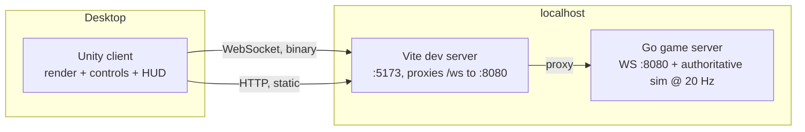

# Architecture

Status: v1 — reflects Phase 1 as built. Updated as each phase lands
(`docs/ROADMAP.md`).

## System overview



- One authoritative Go server process per world instance (M1: single
  instance).
- Clients connect over WebSocket; all world state is server-authoritative.
- **Client delivery is a packaged native desktop build** (Unity, C#) as of the
  Phase 3.5 decision, 2026-08-26. Browser delivery is dropped. See "Client
  delivery" below — the TS/Three.js client shipped Phases 1–3 and is retired at
  the end of Phase 3.5.
- `make up` runs the whole stack on a local **kind** cluster — server, nginx-
  backed client, and (from Phase 2) Postgres — so the deployed path is the
  development path. See "Deployment".
- What kind does *not* exercise is sharding, delta snapshots and load; that is
  the scale-out phase's job, not now.

## Client (`client-unity/`) — Unity 6, C#

- A packaged desktop build. Browser delivery was dropped in Phase 3.5: the
  original Three.js client lived in `client/` and was retired by ROADMAP U18
  once the Unity one passed the same criteria. It is in git history.
- Code-first, and that is a hard rule rather than a style: no agent authors a
  `.unity`, `.prefab` or `.asset`, so every object, material and camera is
  built from C# at runtime. `client-unity/CONVENTIONS.md` has the why.
- Scene: a small low-poly round world — terrain mesh built from the server's
  six-face cube-sphere radius field, sky, scattered props; characters loaded
  from `art/` via `art/manifest.json` by asset id.
- **The camera's up vector is the local radial direction**, not `+Y`. It
  changes continuously as the player walks, and getting it wrong shows up as
  the world slowly rolling. Same for character orientation: remote players
  stand on their own patch of ground, not on yours.
- Net client: WebSocket, binary frames per `docs/PROTOCOL.md`.
- **Camera: one first-person rig, always.** The game is first person on foot
  and in the pilot seat alike (GDD pillar 2), so the client has exactly one
  camera whose *mount point* changes — the body's eye height in M1, a `seat.*`
  node in a vehicle from M2. Build the mount as an indirection from the start;
  do not build a chase cam "for debugging" and let it become load-bearing.
- Look is applied to the camera immediately on input and sent to the server as
  `look_dir`, an absolute world-space unit vector. It is never predicted or
  reconciled — a corrected view is motion sickness. Only position/velocity go
  through prediction and replay.
- Rock props are scattered client-side from `world_seed` onto the sampled
  surface. Every client runs the same TypeScript, so every client scatters them
  identically; the server neither knows nor cares, because M1 props have no
  collision. The moment props become collidable, placement has to move
  server-side.
- **Movement and terrain sampling live in a pure module** — no engine types, no
  renderer, no platform globals (in Unity: an `asmdef` that references
  `UnityEngine` nowhere) — that the render loop calls into. This is not style: the
  conformance test (ROADMAP criterion 5) runs the TypeScript sim headless
  under Node and diffs it against the Go sim, which is impossible if movement
  is entangled with the renderer. Same reason the module takes `dt` and input
  as arguments rather than reading a clock.

  Four things keep this honest, in order of how much work they save:

  1. **The compiler enforces it.** `Assets/Sim/` is its own assembly and may
     not reference `UnityEngine` at all, so touching a `GameObject`, a
     `Transform` or `Time` in that folder is a build error rather than a
     code-review note. `make unity-test` compiles it a second time with no
     Editor in sight, which is what lets the conformance diff run in CI.
     (The retired TypeScript client did the same job with a DOM-free
     `tsconfig.sim.json`.)
  2. **A signature, fixed now**, so the Go and TypeScript sims mirror each
     other and criterion 5 has something to diff:
     `step(state, input, terrain, dt) -> state` and
     `sampleRadius(terrain, dir) -> number`, both pure, both total.
  3. **Build the sim module before the renderer.** Extracting a sim out of a
     finished render loop is where this normally goes wrong; starting with a
     headless module that a renderer later calls costs nothing.
  4. **A ten-line headless smoke test in wave 2**, not wave 3 — `frontend`
     imports the sim under Node and steps it once. It fails the moment someone
     reaches for Three inside `sim/`, which is months before `qa` would have
     found it at the gate.
- **Trajectory dump format** (shared by both sims, so criterion 5 is a file
  diff rather than bespoke harness code): given a JSONL input script — one
  `input` per line plus a starting state — each sim emits JSONL of
  `{tick, pos:[x,y,z], vel:[x,y,z], grounded}` per step. The Go server exposes
  it as a subcommand, the client sim as a Node entry point.
- Local player: client-side prediction, reconciled against snapshots.
- A dev override (query param or console hook) can force the local player's
  position/velocity to a bad value, so authority correction is observable —
  ROADMAP criterion 3 depends on it existing.
- Remote players: ~100 ms interpolation buffer + short extrapolation.
- HUD: DOM overlay (M1) — speed, distance to nearest player, connection state.
  A cockpit-mounted diegetic HUD is a later option, not an M1 obligation.

## Server (`server/`) — Go

- Module `space-adventure/server`; stdlib-first; gorilla/websocket.
- Fixed-tick authoritative simulation: **20 Hz (50 ms)**. Deterministic given
  (world seed, input stream).
- Components: connection manager, entity/component store, tick loop, snapshot
  encoder, gameplay rules (from `docs/GDD.md`, owned by `game`).
- Full snapshot every tick in M1; delta compression is a post-M1 optimization.
- No persistence in Phase 1: in-memory world, seed-based. From Phase 2 the
  world stays in memory and a store is loaded/saved around it — see
  "Persistence"; the tick loop still never touches a database.
- Terrain: generated procedurally once at startup from the world seed as a
  cube-sphere — six `face_grid × face_grid` grids of surface radii, layering
  base relief, masked mountain ridges, detail noise and subtractive craters
  (GDD "M1 terrain generation") — sent to each client on join (PROTOCOL
  `terrain`), and used server-side for on-foot collision by bilinear sample.
  No collision library, no mesh physics — the ground is six arrays and a
  face-selection rule.
- `world_seed` comes from a `--seed` flag with a **fixed default**, not from
  the clock. A seed that changes every boot gives you a different asteroid on
  every restart, which makes iterating on movement against a known landmark
  impossible and makes a bug report unreproducible. Random worlds are one flag
  away when they are wanted.
- Because the field ships over the wire, **the generator is not a contract**:
  no client re-derives it, so the noise functions can be swapped or retuned
  without touching the protocol or the client. Only the shape constraints
  (walkable fraction, flat spawn, radius bounds) are binding, and they are
  checked against the generated field rather than the code.
- **A connection drives an entity; it does not equal one.** In M1 the entity a
  connection drives is its body, which stays true forever. From M2 a player may
  drive a vehicle instead while their body rides in a seat, so keep "the entity
  this input moves" as a lookup rather than a fixed field on the connection —
  that lookup is exactly what taking a pilot seat repoints (GDD "Vehicles and
  crew").

## Persistence (`server/internal/store`) — from Phase 2

One rule makes the database swappable, and it is not an abstraction layer:
**the tick loop never touches the database.** World state lives in memory and
is simulated at 20 Hz; the store is read on join, written on leave, and
snapshotted periodically from a background goroutine. Database latency
therefore never enters the 50 ms tick budget, which is what makes "SQLite file
on a laptop" and "Postgres across a network in a cluster" interchangeable at
all. Get this wrong — a `SELECT` on the hot path — and no amount of interface
polish saves it.

### One driver seam: `database/sql` + a DSN

`database/sql` **is** the portability layer. There is no repository interface,
no two implementations of a `Store` trait, no dialect strategy object. There is
one `store` package holding one set of queries, and the driver is chosen from
the scheme of `DATABASE_URL`:

| `DATABASE_URL` | Driver | Used for |
|---|---|---|
| unset | `sqlite` → `./data/world.db` | bare `go run`, unit tests, the `qa` harness |
| `sqlite:///path/world.db` | `modernc.org/sqlite` | explicit local file |
| `postgres://user:pw@host/db` | `jackc/pgx/v5/stdlib` | kind, and every real deployment |

`modernc.org/sqlite` is **pure Go on purpose**: `Dockerfile.server` builds with
`CGO_ENABLED=0` into a distroless static image, so a cgo SQLite driver
(`mattn/go-sqlite3`) would break the image build, not just the tests.

The only dialect-aware code is one `open(dsn)` function: pick the driver, set
the pool (`MaxOpenConns(1)` on SQLite, WAL mode on; a real pool on Postgres),
run migrations. Everything downstream is plain `database/sql`.

### Portable SQL — the rules that keep one query set working on both

Small, specific, and cheap to follow from the start; expensive to retrofit:

- **`$1` placeholders, never `?`.** SQLite accepts `$N` natively, Postgres
  requires it. One style works on both.
- **No `AUTOINCREMENT` / `SERIAL`.** Ids are generated in Go and inserted
  explicitly, so entity ids match the ones already on the wire.
- **No `BOOLEAN`, no `JSONB`, no `TIMESTAMP`.** Booleans are `INTEGER` 0/1,
  JSON blobs are `TEXT` marshalled in Go. Every one of those is a type whose
  behaviour differs between the two engines.
- **Times and money are `BIGINT`, never `INTEGER`.** Postgres `INTEGER` is
  int4 — it tops out at 2,147,483,647, and a Unix-millis timestamp is about
  1.79 *trillion*. SQLite's `INTEGER` is dynamically sized up to 64 bits and
  stores it without complaint, so this is invisible until the first Postgres
  write. `BIGINT` has INTEGER affinity in SQLite and is 64-bit in Postgres,
  so one spelling is correct on both. This rule was written the wrong way
  round first and caught by the dual-engine test on its first real run —
  which is exactly what that test is for.
- **`INSERT … ON CONFLICT … DO UPDATE` and `RETURNING` are fine** — both
  engines support them (SQLite ≥ 3.24 / ≥ 3.35).
- **No stored procedures, no triggers, no engine-specific extensions.**

### The `player` table (pinned — Phase 2 schema)

```sql
CREATE TABLE IF NOT EXISTS player (
  token       TEXT    PRIMARY KEY,
  name        TEXT    NOT NULL,
  credits     BIGINT  NOT NULL,
  inventory   TEXT    NOT NULL,   -- JSON: [{"item":"ammo.cell","qty":120}]
  equipped    TEXT    NOT NULL,   -- JSON: {"primary":"weapon.pulse"}
  pos_x       REAL    NOT NULL,
  pos_y       REAL    NOT NULL,
  pos_z       REAL    NOT NULL,
  created_ms  BIGINT  NOT NULL,   -- Unix millis: BIGINT, not INTEGER
  updated_ms  BIGINT  NOT NULL
);
```

Every column obeys the portable-SQL rules above: no `SERIAL`, no `JSONB`, no
`TIMESTAMP`, no `BOOLEAN`, and `BIGINT` for the millis and money columns. `REAL` is `double precision` on Postgres and an
8-byte float on SQLite — identical enough for a respawn position, and the sim
never round-trips through it mid-tick.

Reads and writes are one statement each:

```sql
SELECT … FROM player WHERE token = $1;
INSERT INTO player (…) VALUES ($1, …)
  ON CONFLICT (token) DO UPDATE SET
    name = $2, credits = $3, inventory = $4, equipped = $5,
    pos_x = $6, pos_y = $7, pos_z = $8, updated_ms = $9;
```

**`token` is a bearer string, not authentication** — see `docs/PROTOCOL.md`,
"Identity token". The row it selects is the whole account model in Phase 2, and
real accounts replace exactly this lookup and nothing else.

### Migrations without a dependency

Numbered `.sql` files in `server/internal/store/migrations/`, `go:embed`ed and
applied in order at startup against a `schema_version` table. That is roughly
forty lines and it removes a dependency, a CLI, and a "did you run migrate?"
failure mode. A migration that genuinely cannot be written portably gets a
`NNN.postgres.sql` sibling — the escape hatch exists, and needing it is a
signal the schema drifted, not a routine event.

### What actually keeps it honest

Not the design — the test. **The store's test suite runs against both
engines**: SQLite always (no service required, so it runs everywhere), and
Postgres when `TEST_DATABASE_URL` is set. `make test-pg` starts a Postgres
container and sets it. Portability that is not executed on both engines is
portability that is already broken.

And the deployed path uses the real thing: **the kind stack runs Postgres**
(`deploy/manifests/30-postgres.yaml`, a single pod with a PVC), for the same
reason kind itself was chosen in Phase 1 — the acceptance criteria are measured
on the path the product actually takes. SQLite is the developer convenience;
Postgres is the deployed default. If those two ever disagree, the kind stack
finds it, not production.

Config comes from the environment (`DATABASE_URL`), supplied by a K8s Secret.
No DSN in the image, no DSN in a committed manifest.

### Redis and friends: not yet, and here is the trigger

There is no cache and no message bus, because with one server process the
in-memory world **is** the cache and a function call **is** the message bus.
Adding Redis now buys a dependency, a failure mode and a serialization
boundary in exchange for nothing.

It earns its place the moment a second server process needs to see the first
one's state — cross-shard presence, pub/sub between zone servers, sessions
shared across a fleet (Phase 6 territory, `docs/ROADMAP.md` "Deferred"). The
seam that makes that cheap is not an interface written today; it is keeping
presence and session lookups behind ordinary functions in one package, so the
map inside them can become a client later without changing a caller.

## Network model

- Wire contract: `docs/PROTOCOL.md` (little-endian binary, one message per
  WebSocket message).
- Server sends a snapshot (all entities: id, pos, quat, vel, parent_id,
  seat + tick + `ack_seq`) every tick.
- Client sends `input` as **current command state** (latest wins, idempotent),
  tagged with a `seq` counter. The server echoes the `seq` it last applied as
  `ack_seq`.
- Prediction: the local player is simulated client-side in **fixed 50 ms steps
  — the same tick rate as the server**, with the render loop interpolating
  between the last two predicted states for 60 fps smoothness. Sampling input
  at 60 Hz but stepping the sim at 60 Hz too would drift from the server by
  construction (different `dt` through the clamps and the acceleration term),
  and replay would then correct a divergence the client created itself.
- Reconciliation (**replay, not blend**): the client keeps a ring buffer of the
  inputs it has sent. On each snapshot it snaps the local player to the server
  state, discards buffered inputs up to `ack_seq`, and re-integrates the
  remaining ones with the GDD rule table to get back to present time. Remote
  players are interpolated, never replayed.
  - Blending toward server state instead would rubber-band: a snapshot reflects
    input from ~RTT/2 ago, so steady-state error is `velocity × latency` —
    at `sprint_speed` 7.5 m/s and 100 ms that is ~0.75 m of constant lag on
    foot, and roughly 4 m once ships fly at `vmax` 40 u/s. Replay makes the
    error zero when client and server agree.
  - Prediction and server must run the identical rule table and the identical
    integrator (semi-implicit Euler, per-tick `dt`), or replay reintroduces the
    drift it exists to remove. The movement conformance test
    (ROADMAP criterion 5) runs against both.
- Reconnect: M1 = drop and rejoin (new entity id); session resumption later.
- Heartbeat: ping/pong frames; server drops connections silent for 10 s.

## Deployment (`deploy/`) — kind cluster in M1

M1 runs the whole stack through the deployed path from a clean clone: a local
kind cluster (namespace `space-adventure`) is the M1 entry point (ROADMAP
criterion 1).

- `make up` — creates the kind cluster (`deploy/kind.yaml`) if absent, builds
  `Dockerfile.server` / `Dockerfile.client` and loads both images into the
  cluster, applies `deploy/manifests/` (server Deployment + nginx-backed
  client, each with readiness/liveness probes), then waits and fails until
  both host endpoints answer. The endpoints are **kind `extraPortMappings`
  onto NodePort Services** (`deploy/kind.yaml` → `30000`/`30080`), a
  kernel-level mapping — not `kubectl port-forward`:
  - `:3000` → client — nginx serves the built TS client and proxies `/ws` to
    the server. **Retired at the end of Phase 3.5:** a native client is
    downloaded, not served, so it dials the server URL from its own config and
    the same-origin/no-CORS assumption goes with it.
  - `:18080` → server — direct WS + `/healthz`.
- `make down` — deletes the cluster, removes logs, and reaps any stray
  port-forward left by an earlier revision. Leaves nothing running.
- `make up` also `rollout restart`s both Deployments, because the images are
  `:latest` and `kubectl apply` otherwise reports "unchanged" and keeps
  serving the old build.
- `CLIENT_PORT` / `SERVER_PORT` change **only which host port the readiness
  check probes.** The real mapping is fixed in `deploy/kind.yaml` at
  cluster-creation time, so moving it means editing that file and recreating
  the cluster.

**Why kind in M1.** The acceptance criteria are measured on the deployed
stack: criterion 1 is `make up` from a clean clone, and the nginx `/ws` proxy
is part of the wire path the client actually takes.

This used to cost accuracy: `kubectl port-forward` is a userspace TCP proxy
that added its own jitter to criterion 7's latency measurement, and died on a
broken pipe. Replacing it with `extraPortMappings` + NodePort removed both —
C4 despawn went from 1003 ms to 1.2 ms, and C7's p95 from 6.65/17.51 ms to
3.60 ms. Nothing to supervise, nothing to restart, no added jitter.

**Why not more.** One pod per process, one shard, no sharding, no delta
snapshots, no 100+ load — the scale-out milestone is where Kubernetes earns
its keep (one server per system/sector shard, stateless connections behind a
gateway). The client already talks to a URL, so that is an additive change,
not a rewrite.

## Key decisions

| Decision | Choice | Why |
|---|---|---|
| 3D engine (Phases 1–3) | Three.js + TypeScript | deepest ecosystem, browser-native, full control |
| 3D engine (Phase 3.5 on) | Unity + C#, native desktop | humanoid animation, asset pipeline and zone authoring are the gaps Three.js was never going to close; browser dropped, which is what removed Godot's one advantage |
| Server language | Go | one static binary; goroutines fit tick + IO |
| Transport | WebSocket (binary) | simple, works everywhere; revisit UDP if M1 feels limited |
| Authority | server-authoritative | MMO correctness, cheat resistance |
| Local run (M1) | kind cluster + Makefile | `make up` from a clean clone is the M1 entry point; the nginx `/ws` proxy path is part of the contract |
| K8s scale-out | deferred to M6 | sharding, delta snapshots and 100+ load earn the orchestrator's keep; kind already proves the manifests |
| Prediction | replay from `ack_seq` | blending rubber-bands by `velocity × latency`; replay is exact when the rule tables match |
| Assets | glTF 2.0 binary, low-poly | one universal format, reproducible generation |

## Risks / watch items

- **Rule-table drift between Go and TypeScript** is the main correctness risk:
  two implementations of the same movement model, and replay is only exact
  while they agree. The GDD table is the single source; the conformance test
  (ROADMAP criterion 5) runs the same input script through both and diffs.
  Terrain collision makes this sharper than flight would have — a slope
  threshold or step height that differs by a hair puts the two sims on
  different sides of a ledge, and the error is then unbounded rather than
  small. The round world adds a second copy of this: the cube-sphere face
  selection and seam handling must match between Go and TypeScript too, and a
  mismatch is invisible until someone walks over a specific edge.
- Snapshot bandwidth grows linearly with entity count (50 B/entity/tick at
  the M2 entity layout → ~50 KB/s per client at 50 players); delta
  snapshots come after M1.
- On-foot movement is **less** forgiving of latency than flight: a walking
  player changes direction instantly and often, where a ship's momentum smooths
  corrections. Replay reconciliation (above) is what makes this viable, and
  ROADMAP criterion 6 is the measurement that it works.
- The `terrain` message caps out at `face_grid` 73 inside one 64 KiB frame.
  Bigger or more detailed worlds need chunked terrain — a known, bounded
  change, not a surprise.
- **A hardcoded `+Y` up is the characteristic bug of this milestone.** It works
  perfectly at spawn and fails on the far side of the world, so it survives
  casual testing. Movement, camera, character orientation and prop placement
  all have to derive up from position; ROADMAP criterion 10 (walk a full lap) is
  what catches the ones that slip through.
- M1 runs on kind from day one, so the deployed stack (probes, nginx `/ws`
  proxy, image pipeline) is exercised for real; what it does not exercise is
  sharding, delta snapshots and load — the scale-out milestone's job.
